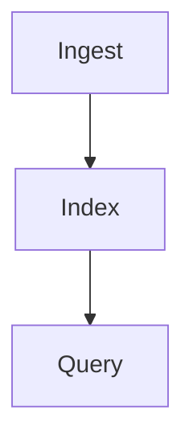

# Notes Markdown

When creating or updating Notcery notes, use **`content_markdown`** as the canonical field (not TipTap `content_json`).

## Authoring rules

- Summaries: `# title` → intro → bullets → optional table → optional `mermaid` flowchart
- Mermaid: fenced ` ```mermaid ` block; node IDs without spaces; quoted labels for special characters
- Callouts: `> [!TIP]`, `> [!NOTE]`, `> [!WARNING]`
- Math: `$inline$` and `$$display$$`
- Tasks: GFM `- [ ]` / `- [x]`
- Collapsible: `<details><summary>...</summary>...</details>`
- Output must be paste-ready note Markdown, not conversational chat tone

Full spec: `backend/apps/ai/prompts/notes_markdown_authoring.txt`

## Example Mermaid



## Example table

| Step | Action |
| ---- | ------ |
| 1 | Upload |
| 2 | Index |
